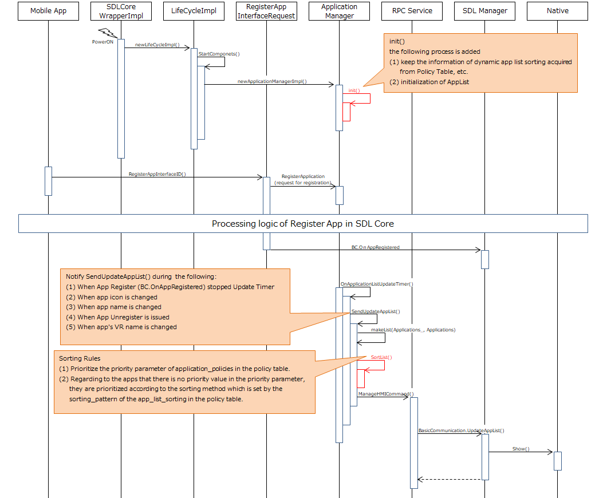

# Dynamic App List Sorting

* Proposal: [SDL-0325](SDL-0325-Dynamic-App-List-Sorting.md)
* Author: [Akihiro Miyazaki (Nexty)](https://github.com/Akihiro-Miyazaki)
* Status: **Withdrawn**
* Impacted Platforms: [ Core / Policy Server ]

## Introduction

This proposal is to clarify the SDL app icon display sequence and to present the dynamic app list sorting methods at the same time. By doing so, we can prevent unnecessary development for the Head Unit (HU) developers and improve usability by enhancing the visuality for users.

## Motivation

Currently, the SDL app icon is displayed on the SDL app selection (menu) screen, but the sequence to display the icon is not provided. Also, there is no explicit definition of the icon's display order or additional rules, for example, grouping by app type. For these reasons, it is difficult for the HU developer to know by what specification the icons are sorted. Also, it is difficult to judge whether or not it is necessary to deal with it on the HMI side. Incidentally, it is implemented on the program code of SDL Core by the following rules:

 1. Registered apps are sorted by the ascending order of appID *1.
 2. Unregistered apps are sorted by the ascending order of policyID in the policy table. If there are duplicate policyIDs, they will be sorted by the ascending order of deviceID.

*1 appID: It is NOT the ID obtained during SDLC App Certification. It is the ID that is set when the app establishes a session and is launched based on the hash algorithm using the sessionID (set from 0 in the app registration order) and deviceHandlerID (set from 0 in the device connection order).

As a result, the display order of icons changes every launch. Furthermore, it is very poor visuality and operability (usability) because it takes a long time for the user to find an app that s/he wants to use. In order to solve these problems, we propose to clarify the display order of the SDL app icon and improve the usability by presenting the SDL app icon display sequence and the dynamic app list sorting methods.

## Proposed solution

The following items are proposed to improve the problems mentioned above.
 1. Presentation of the dynamic app list sorting methods
 2. Clarification of icon display sequence

<b>1. Presentation of the dynamic app list sorting methods</b><br>
The dynamic app list sorting is performed according to the following procedures.

 1. Set the priority (such as 1st, 2nd, 3rd, etc.) to the parameter `priority` of the `application_policies` on the policy table. (OEMs can modify the priorities themselves.)
 2. Implement the `app_list_sorting` parameter below in the SDL Core sdl_preloaded_pt.json and the policy table. (OEMs can modify each parameter value of the policy table.)
  - "appHMIType" : The sorting method by using the `appHMIType_sorting_list`.
  - "alphabetical" : The sorting method according to alphabetical order.
  - "appID" : The sorting method according to the `appID` order of the `application_policies` on the policy table.
 3. During the first launch, there is no policy table, therefore the app list is searched in the default policy table at first, then can be searched in SDL Core to obtain the `app_list_sorting` information. If the 'app_list_sorting' information is not present, the list is sorted how it was previously sorted.
 4. The apps are registered to the SDL Core by using the `RegisterAppInterface`.
 5. The sorting order is performed according to the following procedures.
	1. Prioritize the `priority` parameter of `application_policies` in the policy table.
	2. Regarding the apps that do not have a priority value in the `priority` parameter, they are prioritized according to the sorting methods which are set by the `sorting_pattern` of the `app_list_sorting` in the policy table.
 6. The sorting list is sent to the HMI by using the `UpdateAppList`.

```json
app_list_sorting: {
    "sorting_pattern": "appHMIType",
    "appHMIType_sorting_list": {
        "NAVIGATION": 1,
        "MEDIA": 2,
        "MESSAGE": 3,
        "INFORMATION": 4,
        "COMMUNICATION": 5,
        "SOCIAL": 6,
        "PROJECTION": 7,
        "REMOTE_CONTROL": 8,
        "SYSTEM": 9,
        "DEFAULT": 10,
        "BACKGROUND_PROCESS": 11,
        "TESTING": 12
    }
}
```

By changing the parameters of  `appHMIType_sorting_list` and `priority` created by each OEM in the policy table, OEMs can display the SDL app icon according to their own intended order.

<b>2. Clarification of icon display sequence</b><br>
Currently, there is no sequence provided that demonstrates how the icon is displayed. Figure 1 shows the sequence in which the process of this proposal is added to the existing sequence from the program code of SDL Core.
- The black text indicates the existing order described in the program code.
- The red text indicates the process added by this proposal.

<b>Figure 1.</b> SDL App Icon display sequence



## Potential downsides

As there is a large modification required to implement multiple sorting methods, the developer must do the implementation carefully and it will take a long time. Also, the system may need to remove the sorting function from the HMI.

## Impact on existing code

The existing sorting process is left as it is. Furthermore, as processes/lists related to sorting are added, SDL Core is affected. Also, since the priority information of `appHMIType_sorting_list` is stored, the policy server is affected, too. However, I believe their changes are minor version changes because there are no changes in RPC and parameters.

## Alternatives considered

The alternative sorting method is user-defined sort order. This sorting method would be a feature that some OEMs would want. However, since this specific sorting method would only be part of the HMI and have no other SDL component integration, we think it is difficult for SDL Core to contain the user-defined sort order function.
