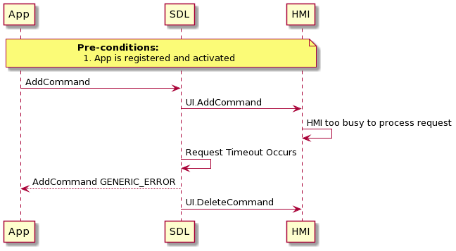

# Handle Late Malformed HMI Responses

* Proposal: [SDL-0326](0326-handle-late-malformed-hmi-responses.md)
* Author: [JackLivio](https://github.com/JackLivio)
* Status: **Accepted**
* Impacted Platforms: [Core / HMI]

## Introduction

This proposal aims to expand the requirements for SDL Core's handling of HMI responses that were late (received after timeout), malformed, or lost. In the event one of these cases in encountered by SDL Core, SDL Core should make an effort to resynchronize its data with an HMI by reverting the failed requests.

## Motivation

In the event the HMI is overloaded and unable to process request/responses from SDL Core within the specified timeout, the HMI may become de-synchronized with the contents that SDL Core expects the HMI to be displaying. 

For example: If SDL Core sends a large number of AddCommands to the HMI, the amount of time it takes for the HMI to process each request can grow. If these responses are sent by the HMI to SDL Core after the SDL Core timeout has occurred, SDL Core will report this request as a failure to the Mobile device that made the request. The issue that arises is the HMI may be stuck displaying menu items that should not exist.

The same concept applies to messages that were lost or malformed. In these cases something went wrong with the HMI integration and Core should take steps to try and revert the bad requests.

## Proposed solution

### Handle Late, Lost, Malformed messages

In the event a request to the HMI is late, lost, or malformed, SDL Core should take a specific action to undo the request that failed due to being late, lost, or malformed. 

Example diagram for handling a missing response from an AddCommand request to HMI:

The following list shows HMI RPCs that have a corresponding RPC used to revert previously requested data:

- AddCommand -> DeleteCommand
- AddSubMenu -> DeleteSubMenu
- CreateInteractionChoiceSet -> DeleteInteractionChoiceSet
- SetGlobalProperties -> ResetGlobalProperties
- CreateWindow -> DeleteWindow
- SubscribeWayPoints -> UnsubscribeWayPoints
- SubscribeVehicleData -> UnsubscribeVehicleData
- GetInteriorVehicleData isSubscribed:true -> GetInteriorVehicleData isSubscribed:false
- GetAppServiceData subscribe:true -> GetAppServiceData subscribe: false

SDL Core should not attempt to revert HMI data that had a valid error response. 

## Potential downsides

If the HMI is taking too long to process requests because the system is overloaded, SDL Core will be required to send more messages to the HMI to undo certain requests. Creating more requests will end up using more SDL Core -> HMI bandwidth. 

However the proposed solution was selected because it aligns with existing and implemented behavior defined in proposals [SDL 188](https://github.com/smartdevicelink/sdl_evolution/blob/master/proposals/0188-get-interior-data-resumption.md) and [SDL 190](https://github.com/smartdevicelink/sdl_evolution/blob/master/proposals/0190-resumption-data-error-handling.md). These proposals add behavior where SDL Core will undo these same types of requests in case of a failed resumption scenario.

## Impact on existing code

Note: This proposal will impact SDL Core and the HMI only.

### SDL Core

SDL Core will be required to add logic to handle late, malformed, or lost HMI responses for the previously specified HMI RPCs.

In addition, SDL Core should expand the functionality of proposals [SDL 188](https://github.com/smartdevicelink/sdl_evolution/blob/master/proposals/0188-get-interior-data-resumption.md) and [SDL 190](https://github.com/smartdevicelink/sdl_evolution/blob/master/proposals/0190-resumption-data-error-handling.md) by reverting resumption data sent to the HMI whose response was lost, malformed, or late. The current implementation of SDL Core will not revert requests if the HMI response is lost, malformed, or late.

### HMI

HMI integrations need to be prepared to handle potentially erroneous delete/unsubscribe commands from SDL Core. When a message is lost, SDL Core is unsure if the HMI received the original request and how much of the request was processed. To ensure a proper cleanup of the failed requests, SDL Core will send the appropriate delete/unsubscribe request even though the HMI may not recognize the data SDL Core is requesting to delete. This case is rare, but should still be handled.

## Alternatives considered

An alternate solution would be to add a series of new HMI RPCs that present an app's available subscriptions, menu items, and choice sets to the HMI in an array similar to the `UpdateAppList` RPC. From such RPCs the HMI could compare lists to delete invalid subscriptions/menu items.

This would be a cleaner solution to ensuring data between the HMI and Core is synced correctly, however such RPCs would put a great strain on the head unit due to the max number of AddCommands, SubMenus, ChoiceSets, and subscriptions an app can have. Also such a change would be a breaking change to how such data is currently communicated to the HMI.

An additional alternative enhancement to the base proposal would be to include a retry sequence for hmi messages that were late, malformed, or lost. This solution was not included in the proposal due to some added timing complexities. If retries were included, the time for an app to register with resumed data would be extended by the time it takes to retry the requests. Worst case time to register would be <RPC timeout> * <number of retries>.

