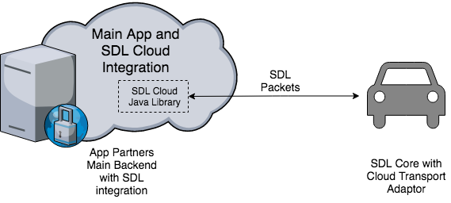
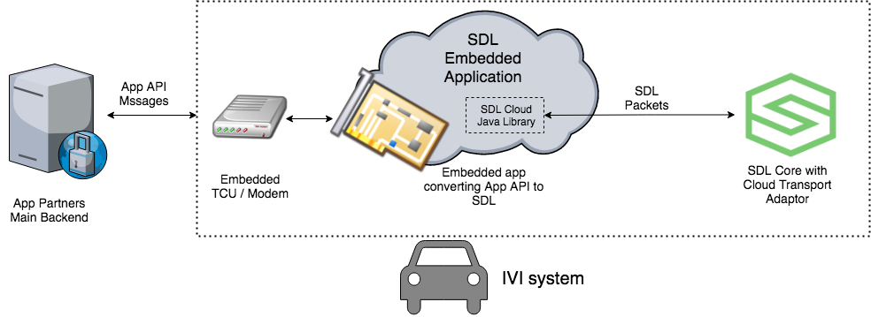
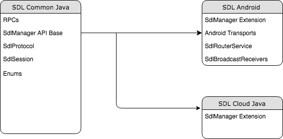

# Cloud App Library - Phase 1

* Proposal: [SDL-NNNN](NNNN-cloud_client_library_phase_1.md)
* Author: [Joey Grover](https://github.com/joeygrover)
* Status: **Awaiting Review**
* Impacted Platforms: **New: Cloud - Java** 

## Introduction

With the acceptance of the [Cloud Transport Adapter](https://github.com/smartdevicelink/sdl_evolution/blob/master/proposals/0158-cloud-app-transport-adapter.md) it is necessary to enable cloud and embedded apps to integrate a client side library for SDL. This proposal will best device how to put a library out quickly that is adaptable for both cloud and embedded situations. With that goal in mind, the first phase of cloud/embedded libraries intends to be written in Java. A majority of the code base will be extracted from the SDL Android Library project to start and a common subset of that code will be created to feed into both projects.

## Motivation

The best way to support cloud and embedded applications would be to utilize a single library that can be extended to many platforms. The SDL Android Library gives the SDLC a head start on extending SDL into both the cloud and embedded application space. 

#### Minimal Maintenance Introduced

The proposal will describe how the reach of SDL can be increased with minimal extra long term cost introduced. While there is an upfront work to refactor exiting code, it is less than starting from scratch. 

#### Java's Portability

Java's main advantage is that it can be written once, and ran everywhere. While there are obvious caveats to that, it is still one of the most adaptable languages in large part to the JVM. Most commercial embedded operating systems have at least some offering of the JVM and Java has been a part of the web ecosystem for a long time.

##### Java for different platforms

Java has been expanded to many different areas outside of the standard edition for specific applications, web/mobile/embedded. Java Enterprise Edition (EE) is a superset of Java Standard Edition (SE) so creating the common library with the subset of Java SE available through the Android SDK will enable developers to tailor their cloud integrations for large-scale applications. 

#### Opportunity to refactor

This proposal will also give the SDL Android Library a chance to refactor code that was introduced by contractors prior to the SDLC so that everything makes sense in terms of naming as well as functionality. This will increase the stability, performance, and maintainability of the SDL Android Library as an added side effect.

#### Phase 2 Intentions

With the maintenance burden being minimized, it will also be possible to create a more cloud/web centric library. This library, **while not up for consideration in this proposal**, would intend to be written in a language and framework like Javascript and node.js as it is popular among start ups and has a valid following. With this intention in mind and this Phase 1 proposal, the cloud/embedded platform would have a lot of integration use cases covered while not over stretching its efforts. 

## Proposed solution

This proposal intends to introduce a change to existing libraries and creation of a few additional libraries. The proposed solution is to refactor the SDL Android Library into a common pure Java library, and the Android library on top of it. It also introduces a new Cloud library that will be built off the same common Java library.

#### Application Architecture

##### SDL Cloud Library in main backend

The first potential architecture would be to simply include the SDL library into the main backend of the application. This would be possible if the backend supported a Java application or written in Java itself.

##### SDL Cloud as separate endpoint

Secondly, the library could be deployed to a standalone server that was separated out from the main backend. In the example provided it shows how it can be connected to the backend by utilizing exposed API hooks into the application. The SDL cloud application server would translate that API into the SDL messages and integration for a cloud app to connect to Core.

##### SDL Cloud as Embedded App

Lastly, the library could be deployed in an embedded app that ran on the IVI system or a different module that had access to the local network for Core to connect to the app.

#### Code base

##### Code Architecture

The library would follow the SDL Android library. This would include the new manager APIs that have been created to align with the iOS platform. The idea is to keep this as similar to the android integration as possible so that developers don't feel overwhelmed if moving from one to the other and keeping as much of their integration as aligned as possible.

##### Proposed project hierarchy:

The solution will have three defined milestones that should be implemented over a span of time.

1. Refactor and extract SDL Android library to pure Java
2. Create `sdl_java_common` library 
3. Implement `sdl_java_common` back into SDL Android Library

### Refactor and extract SDL Android library to pure Java

The cloud/embedded java library will first be created by taking the SDL Android library and refactoring only the necessary parts to create a pure java implementation.

The idea will be to create a single library that is refactored. This could be released as an Alpha/Beta version in order to get the library out soon, but allow us to prepare for potential breaking changes when creating the `sdl_java_common` library. 

#### Refactor where it makes sense

There are areas of the library that could use refactoring either from poor original implementation/design, incorrect terminology, etc. This would be the ideal time to take care of those issues.

Some of those issues are as follows:

- `SessionType.java` This is supposed to be Service type. 
- `ByteEnumer.java` This implementation is orphaned and should be removed in favor of standard Enums
- Any references to PCM or H264/NAV as service types. They should be `AudioStreaming` and `VideoStreaming` 
- Remove any deprecated code

### Create `sdl_java_common` library 

Once a working a refactored library has been created, a new library will be extracted from that code base to become the `sdl_java_common` library. This would take into account platform specific APIs that can be used and how each of the classes can be extended in a way that works for all. 

The library will at least include the following:

- All RPCs and structs
- Manager API (at a base level)
- SdlProtocol
- SdlSession
- All Enums 

### Implement `sdl_java_common` back into SDL Android Library

After the creation of the common library, the SDL Android library will then need to include the `sdl_java_common` library and make the necessary changes to support it. This is almost guaranteed to be a breaking change so its timing could be pushed from the initial start of the proposal implementation. 

## Potential downsides

- Not all cloud applications will be written in Java, likely not even the majority.
- JVM's will have different performance based on their integrations into specific hardware and operating systems
- Some code in the `sdl_java_common` library will become a bit fragmented to allow for adaptability between platforms
- If phased two is agreed upon, there would be two ways to implement SDL into the cloud/embedded. This would require maintenance to both. However, this library would need most of its maintenance for the Android library anyways. 

## Impact on existing code

- Eventually the `sdl_android_library` will require a breaking change to support the common library. 
- The common library will require existing code to be altered in a way that will allow easy extension into each of the supported platforms. 
- New repos will be created and require a dependency chain into a few (Android library, cloud library, etc)

## Alternatives considered

- This library could be omitted and all resources pushed to a singular API library. 